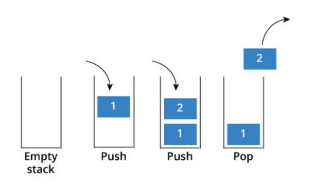

# 아이템7 : 다 쓴 객체 참조를 해제하라

---

- JVM 은 GC 가 메모리를 관리한다
- GC 가 있다고해서 개발자가 메모리 관리를 신경을 쓰지 않아도 오해할 수 있다.
- 스택을 간단히 구현한 다음 코드를 보자




```java

import java.util.Arrays;
import java.util.EmptyStackException;

public class Stack {

    private static final int DEFAULT_CAPCITY = 16;

    private Object[] elements;
    private int size = 0;

    public Stack() {
        elements = new Object[DEFAULT_CAPCITY];
    }

    public void push(Object e) {
        ensureCapacity();
        elements[size++];
    }

    public Object pop() {
        if (size == 0) {
            throw new EmptyStackException();
        }
        return elements[--size]; // 중요
    }

    private void ensureCapacity() {
        if (elements.length == size) {
            elements = Arrays.copyOf(elements, 2 * size + 1);
        }
    }
}

```

- 별 문제 없어 보이지만 elements[--size] 이와 같이 반환값을 해놓는다면 실제 값은
삭제되지 않고 인덱스만 한칸씩 이동하는 것으로 메모리 누수가 발생

- 해결 방안
  - 해당 참조를 다 쓰면 null 로 초기화

```java
public Object pop() {
    if(size == 0){
        return new EmptyStackException();
    }
    
    Object result = elements[--size];
    elements[size] = null;
    return resut;
}
```

----

### 다 쓴 객체는 모두 null 로 처리해야 되는가?
- 모든 객체를 null 로 만들면 프로그램을 필요 이상으로 지저분하게 만든다.
- 객체 참조를 null 처리하는 일은 예외적인 경우여야 한다
- 즉 참조 해제의 가장 좋은 방법은 참조를 담은 변수를 유효 범위 밖으로 밀어내는 것이다.
- 가장 좋은 방법은 지역 변수의 범위를 최소화 하는 것이다
- 